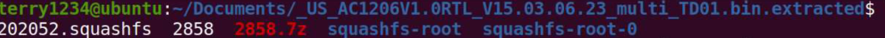
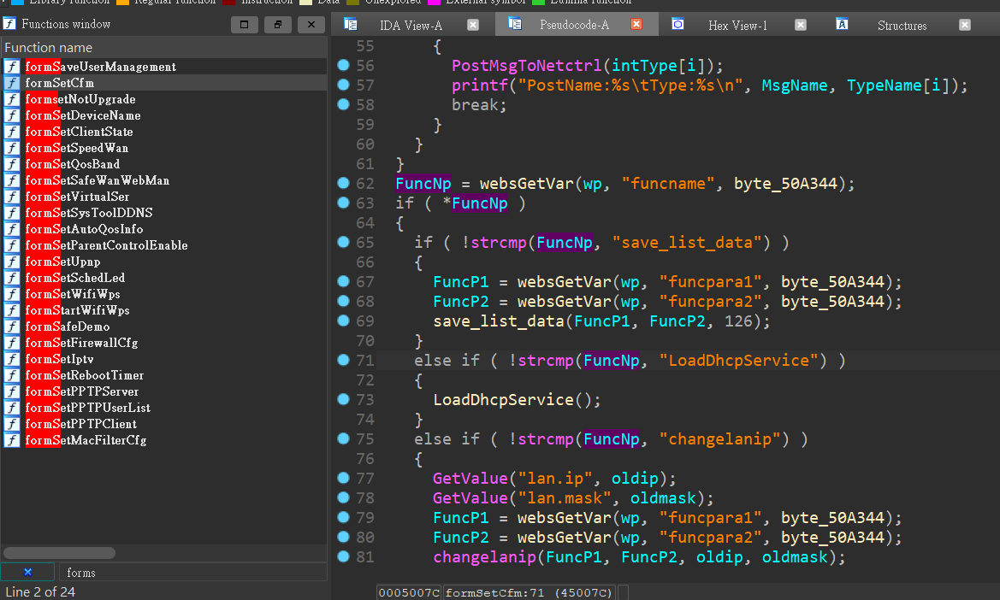
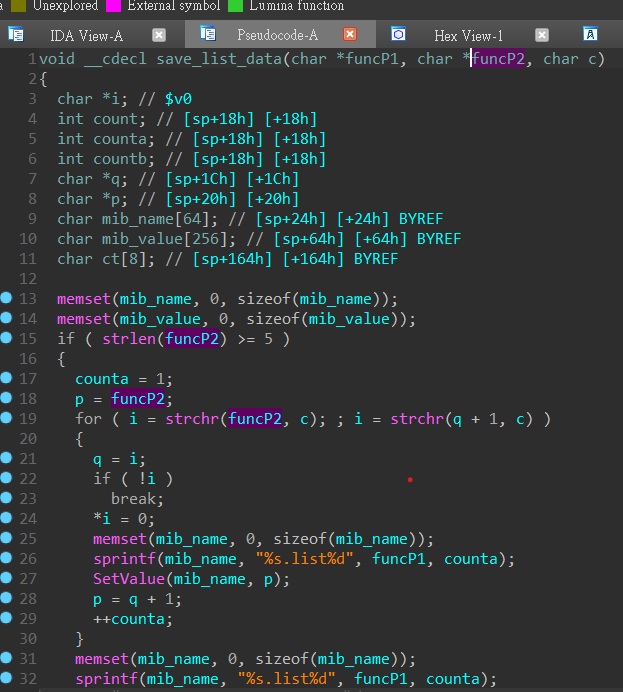
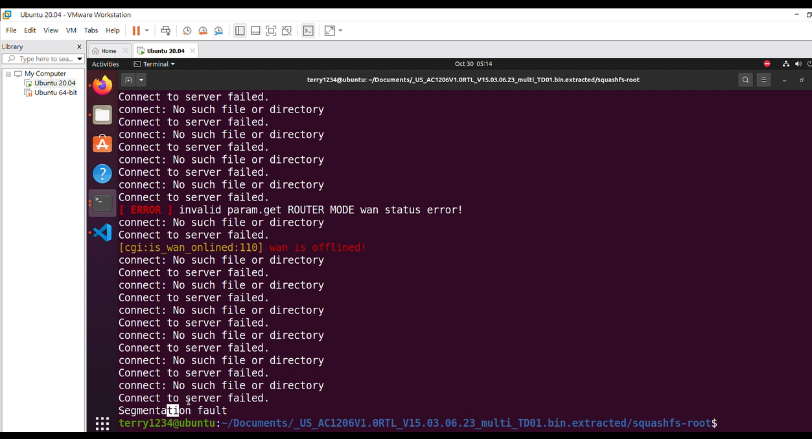

### firmware extraction
use binwalk to extract the firmware
```
binwalk -e US_AC1206V1.0RTL_V15.03.06.23_multi_TD01.bin
```



Now we can analyze the binaries in the file system.
### Vulnerability
/bin/httpd is a binary that handles the http request.
In function formSetCfm(), it use websGetVar() to get parameters from HTTP request. websGetVar() store the parameters as string in bss then retern a pointer to it.
If funcname is "save_list_data", it will get funcpara1 and funcpara2 from HTTP request and call save_list_data(funcP1, funcP2, 126)


In save_list_data(), it use sprintf() to put funcP1 into mib_name(A address on stack), causing Stack Buffer Overflow.


This Vulnerability is assigned as CVE-2024-23621.

### PoC demo
https://github.com/qingwei4/Router-VR/blob/main/CVE-2024-53621/poc.mp4

