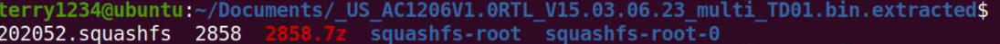
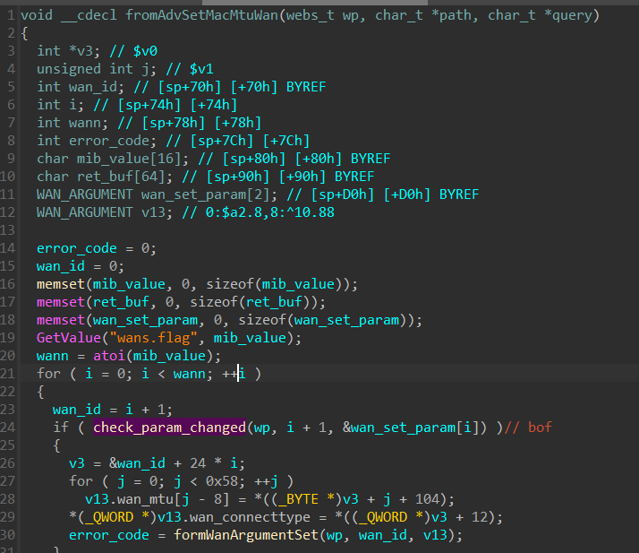
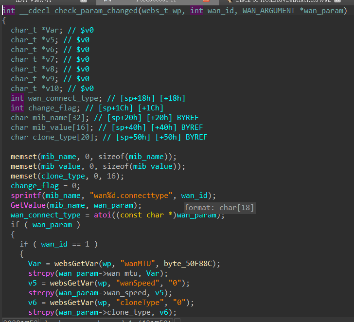

### firmware extraction
unzip and use binwalk to extract the firmware
```
unzip US_AC1206V1.0RTL_V15.03.06.23_multi_TD01.zip
binwalk -e US_AC1206V1.0RTL_V15.03.06.23_multi_TD01.bin
```



Now we can analyze the binaries in the file system.
### Vulnerability
/bin/httpd is a binary that handles the http request.
when API route /goform/AdvSetMacMtuWan is accessed, function fromAdvSetMacMtuWan() will be called.
fromAdvSetMacMtuWan() will call check_param_changed()

In function check_param_checked(), it use websGetVar() to get parameters from POST request. After that, it call strcpy(). Note that websGetVar() doesn't check the length of the parameter, which leads a stack buffer overflow.
